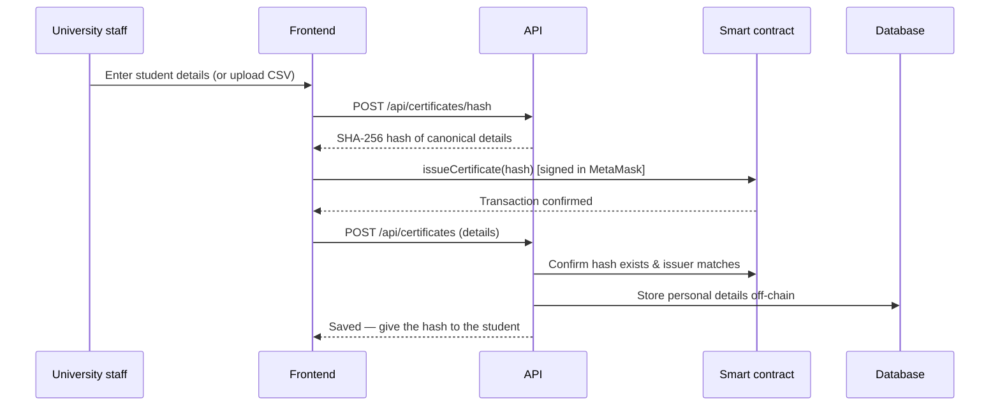
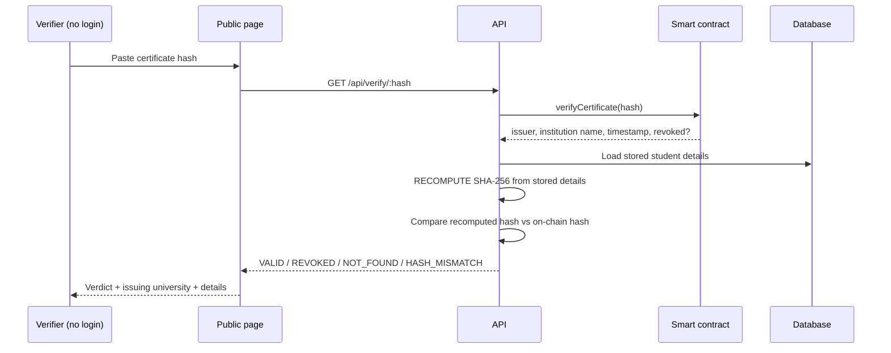

# CertVerify — Blockchain-Based Academic Certificate Verification

> **One platform for many universities.** An employer pastes a certificate code on a single
> public page and instantly learns whether it is genuine — and which university issued it.
> No login, no phone calls, no waiting weeks.

**🌐 Live demo:** https://certverify-eta.vercel.app
**⛓️ Contract (Ethereum Sepolia):** [`0xd017c0F939BeC9FbF622351ed2C56bD311aF4f00`](https://sepolia.etherscan.io/address/0xd017c0F939BeC9FbF622351ed2C56bD311aF4f00)

Final-year project — **Hassan Blessing Sudir**, Cyber Security Science,
Federal University of Technology, Minna.

---

## Table of contents

1. [The problem](#1-the-problem)
2. [What makes this different](#2-what-makes-this-different)
3. [How it works](#3-how-it-works)
4. [The integrity guarantee](#4-the-integrity-guarantee-the-core-idea)
5. [Architecture](#5-architecture)
6. [Tech stack](#6-tech-stack)
7. [Project structure](#7-project-structure)
8. [Quick start](#8-quick-start)
9. [Full local setup](#9-full-local-setup)
10. [Deploying](#10-deploying)
11. [Using the platform](#11-using-the-platform)
12. [Smart contract reference](#12-smart-contract-reference)
13. [REST API reference](#13-rest-api-reference)
14. [The canonical hash](#14-the-canonical-hash)
15. [Security model](#15-security-model)
16. [Testing](#16-testing)
17. [Troubleshooting](#17-troubleshooting)
18. [Limitations & roadmap](#18-limitations--roadmap)

---

## 1. The problem

Academic certificate fraud is widespread. Verifying a degree traditionally means calling or
emailing the university — slow (sometimes weeks), expensive, and unreliable.

Worse, most universities keep records in a single ordinary database. That database can be
hacked, altered by a corrupt insider, or lost. **Nothing proves the record you see today is
the record that was originally created.**

## 2. What makes this different

Blockchain certificate systems already exist — but they typically serve **one university per
deployment**. An employer holding five certificates from five universities would have to visit
five different websites and know in advance who issued what.

**CertVerify is one shared platform for many universities.**

- Many universities register on the **same** contract and issue to the **same** registry.
- A verifier uses **one public page** for all of them.
- The verifier **never selects a university** — the system derives the issuer from the
  certificate hash automatically and displays it as part of the result.

This single requirement drives every design decision below.

## 3. How it works

### Issuing a certificate



### Verifying a certificate



## 4. The integrity guarantee (the core idea)

Personal data cannot go on the blockchain (it would be permanent and public). So student
details live in an ordinary database — which reintroduces the "someone could edit the
database" problem.

**CertVerify solves this by never trusting the database.** Verification does **not** simply
look up a record and display it. For every check it:

1. Reads the certificate's on-chain record (issuer, timestamp, revoked status).
2. Loads the stored details from the database.
3. **Recomputes the SHA-256 hash from those stored details.**
4. Requires the recomputed hash to **equal the on-chain hash**.

A certificate is **VALID only if the recomputed hash matches the on-chain hash *and* the
certificate is not revoked.**

> If a corrupt staff member edits a grade, a name, or a degree title in the database, the
> recomputed hash no longer matches the immutable on-chain hash, and verification returns
> **`hash_mismatch`** instead of showing the tampered record as genuine.

| Verdict | Meaning |
|---|---|
| `valid` | Hash matches on-chain **and** not revoked |
| `revoked` | Genuine, but the issuing university revoked it |
| `not_found` | No such certificate on-chain (mistyped or fake) |
| `hash_mismatch` | Off-chain record was altered — **tampering detected** |

## 5. Architecture

Four layers, each with one responsibility:

| Layer | Responsibility |
|---|---|
| **User interface** | Public verification page, university dashboard, admin dashboard |
| **Application logic** | Hashing, chain communication, recompute-and-compare, off-chain storage |
| **Blockchain** | Immutable certificate hashes, issuer identity, timestamps, validity |
| **Off-chain database** | Personal student data, institution metadata, verification logs |

### On-chain vs off-chain (a hard rule)

| Stored **on-chain** | Stored **off-chain** |
|---|---|
| Certificate hash (SHA-256) | Student name, matric number |
| Issuing institution wallet | Degree title, department, year |
| Issue timestamp | Institution contact details |
| Validity / revoked status | Verification logs |

**Personal data is never placed in a transaction.** Transaction calldata is permanent and
publicly readable, so the backend computes hashes and only a `bytes32` ever reaches the chain.

### How the issuer is identified automatically

A certificate is **keyed by its hash**, and the stored record carries the issuer's wallet:

```solidity
mapping(bytes32 => Certificate) certificates;  // hash → { issuer, issuedAt, revoked, exists }
mapping(address => Institution) institutions;  // wallet → { name, registered }
```

`verifyCertificate(hash)` looks up by hash alone, reads `issuer`, and returns that
institution's name. That is why the verifier never needs to choose a university.

## 6. Tech stack

| Component | Technology |
|---|---|
| Smart contract | Solidity `0.8.24`, Hardhat, deployed to Ethereum **Sepolia** |
| Hashing | **SHA-256** (Node `crypto` off-chain; Solidity `sha256()` precompile on-chain) |
| Backend | Node.js, **ethers.js v6**, Express (local) / serverless functions (production) |
| Database | **libSQL** — a local file in development, **Turso** in production |
| Frontend | Vanilla JS + ES modules, ethers via CDN, **no build step** |
| Wallets | MetaMask & any **EIP-6963** wallet, plus **WalletConnect** (mobile/QR) |
| Hosting | **Vercel** (static frontend + `/api/*` serverless functions) |

## 7. Project structure

```
certverify/
├── contracts/          CertificateRegistry.sol — the smart contract
├── test/               Hardhat unit tests (18, security-focused)
├── scripts/            deploy.js, e2e-local.js
├── backend/
│   ├── src/
│   │   ├── hash.js            canonical preimage + SHA-256
│   │   ├── chain.js           read-only ethers contract
│   │   ├── db.js              libSQL queries
│   │   ├── services/          verify / certificate / institution logic
│   │   ├── routes/  app.js    Express app (local dev)
│   ├── scripts/        init-db.js, migrate.js, sync-abi.js
│   └── test/           unit tests (15)
├── api/                Vercel serverless functions (production API)
├── frontend/
│   ├── index.html             public verification page
│   ├── university.html        university dashboard
│   ├── admin.html             admin dashboard
│   └── assets/                styles.css, config.js, eth.js, wallet.js, ui.js
├── database/schema.sql        off-chain schema
└── deployments/               recorded contract addresses
```

## 8. Quick start

**Prerequisites:** Node.js 18+ and npm. (MetaMask only needed for the UI.)

```bash
git clone https://github.com/weezie001/certverify.git
cd certverify
npm install

npm test        # 18 contract tests
npm run e2e     # full end-to-end against a freshly deployed contract
```

`npm run e2e` deploys the contract to an in-process chain and drives the **real backend
hashing and verification logic** against it — register → issue → verify → tamper → revoke —
with no database or wallet required. It's the fastest way to see the whole system prove itself:

```
✓ Admin registered FUT Minna and UNILAG on one platform
✓ Unregistered wallet was blocked from issuing
✓ Verification returns VALID
✓ Issuing university auto-detected: "Federal University of Technology, Minna"
✓ Tampered off-chain details detected (HASH_MISMATCH) — not shown as valid
✓ UNILAG was blocked from revoking FUT Minna's certificate
✓ After issuer revocation, verification returns REVOKED
✓ Unknown certificate returns NOT_FOUND
```

## 9. Full local setup

Run the complete app (contract + API + UI) on your machine.

### Step 1 — Start a local blockchain

```bash
npm run node          # Hardhat node on http://127.0.0.1:8545, prints 20 test accounts
```

### Step 2 — Deploy the contract to it

```bash
npm run deploy:local  # prints the contract address; the deployer becomes platform admin
```

### Step 3 — Configure and start the backend

```bash
cd backend
npm install
cp .env.example .env
```

Edit `backend/.env`:

```ini
RPC_URL=http://127.0.0.1:8545
CONTRACT_ADDRESS=<address printed in step 2>
DB_FILE=file:./certverify.db     # local file — no database server needed
```

```bash
npm run db:init       # create the tables
npm start             # API on http://localhost:4000
```

### Step 4 — Serve the frontend

```bash
cd ../frontend
npx serve .           # http://localhost:3000 (any static server works)
```

> ⚠️ Open it via **http://**, never by double-clicking the file. ES modules and `fetch`
> are blocked on `file://` URLs.

### Step 5 — Point MetaMask at the local chain

1. Add a network: RPC `http://127.0.0.1:8545`, **Chain ID `31337`**, symbol `ETH`.
2. Import a private key printed by `npm run node` (account #0 is the platform admin).

The frontend reads its contract address from `frontend/assets/config.js`; update the default
there if you want the local address baked in.

## 10. Deploying

### Smart contract

Create a root `.env` (git-ignored — **never commit it**):

```ini
SEPOLIA_RPC_URL=https://ethereum-sepolia-rpc.publicnode.com
DEPLOYER_PRIVATE_KEY=<private key of a funded wallet>
```

```bash
npm run deploy:sepolia
```

The deploying wallet becomes the **platform admin**. The address is written to
`deployments/sepolia.json` and the backend ABI is re-synced automatically.

> The contract is **immutable** once deployed. Redeploying creates a new instance with a new
> address and an empty registry. It is EVM-standard, so the same command deploys to Polygon,
> Base, or any EVM chain by adding that network to `hardhat.config.js`.

### Database (Turso)

```bash
# create a database at https://turso.tech, then:
cd backend
# set TURSO_DATABASE_URL and TURSO_AUTH_TOKEN in .env
npm run db:init       # create tables
npm run migrate       # apply later column additions (idempotent)
```

### Hosting (Vercel)

The whole app is one Vercel project: `frontend/` is served statically and `api/` becomes
serverless functions at `/api/*`.

```bash
npm i -g vercel
vercel link
vercel env add RPC_URL
vercel env add CONTRACT_ADDRESS
vercel env add TURSO_DATABASE_URL
vercel env add TURSO_AUTH_TOKEN
vercel --prod
```

Because the API is same-origin, the frontend's API base resolves to `""` automatically —
no configuration needed. See [DEPLOY.md](DEPLOY.md) for the detailed walkthrough.

## 11. Using the platform

### As the platform administrator

1. Open `/admin.html` and connect the **admin wallet** (the deployer).
2. Verify the university's accreditation **outside the system** — this is deliberately a
   human decision.
3. Fill in the university's name, wallet address, and details, then **Register university**.
   MetaMask asks you to confirm one transaction.
4. The dashboard shows platform stats and a directory of every registered university with
   its certificate count and registration date.

### As a university

1. Open `/university.html` and connect a **registered institution wallet**.
2. **Issue one certificate:** fill in the graduate's details → confirm in MetaMask → copy the
   generated hash and give it to the student.
3. **Issue many at once:** drag a **CSV or JSON** file onto the upload tile. Required columns:

   ```csv
   fullName,matricNumber,degreeTitle,department,yearOfGraduation
   Ada Obi,2021/1/0001,BSc Computer Science,Computer Science,2025
   ```

   (Header names are flexible — `matric`, `degree`, `dept`, `year` all map correctly. Use the
   **Download CSV template** button for the exact format.) Each record is a separate
   transaction, so expect one wallet confirmation per student.
4. **Review and revoke:** the dashboard lists every certificate you've issued with its live
   on-chain status, and a **Revoke** button on each row.

### As a verifier (employer)

1. Open the home page — **no account, no wallet, no login**.
2. Paste the certificate hash and press **Verify**.
3. You get a verdict, the **issuing university (detected automatically)**, and the
   certificate details if valid.

## 12. Smart contract reference

`contracts/CertificateRegistry.sol`

| Function | Access | Description |
|---|---|---|
| `registerInstitution(wallet, name)` | admin only | Approve a university. Emits `InstitutionRegistered` |
| `issueCertificate(certHash)` | registered institution | Records a hash. Rejects duplicates. Emits `CertificateIssued` |
| `verifyCertificate(certHash)` | public `view` | Returns `(isValid, issuer, institutionName, issuedAt, revoked, exists)` |
| `revokeCertificate(certHash)` | **original issuer only** | Marks revoked. Emits `CertificateRevoked` |
| `computeHash(preimage)` | public `pure` | On-chain SHA-256 helper — call as a view only |

`isValid = exists && !revoked`

**Custom errors:** `NotAdmin`, `NotRegisteredInstitution`, `AlreadyRegistered`, `EmptyName`,
`ZeroAddress`, `InvalidHash`, `CertificateExists`, `CertificateNotFound`, `NotIssuer`,
`AlreadyRevoked`.

> `computeHash` exists so tests can prove the Solidity `sha256()` precompile produces exactly
> the same digest as Node's `crypto`. Call it via `eth_call` only — passing real student data
> in a transaction would publish it permanently.

## 13. REST API reference

| Method | Endpoint | Purpose | Auth |
|---|---|---|---|
| `GET` | `/api/health` | Liveness check | — |
| `GET` | `/api/verify/:hash` | **Integrity-checked verification** | none (public) |
| `POST` | `/api/certificates/hash` | Compute the canonical hash | — |
| `POST` | `/api/certificates` | Persist details after on-chain issuance | issuer wallet |
| `GET` | `/api/certificates?issuer=0x…` | List an institution's certificates | — |
| `POST` | `/api/institutions` | Save metadata after on-chain registration | admin |
| `GET` | `/api/institutions` | List all registered universities | — |
| `GET` | `/api/institutions/:wallet` | One institution's metadata | — |
| `GET` | `/api/stats` | Platform counts for the dashboard | — |

Example:

```bash
curl https://certverify-eta.vercel.app/api/verify/0xYOUR_HASH
```

```json
{
  "verdict": "valid",
  "isValid": true,
  "issuingUniversity": "Federal University of Technology, Minna",
  "issuedAt": 1750000000,
  "certificate": {
    "fullName": "Ada Obi",
    "matricNumber": "2021/1/0001",
    "degreeTitle": "BSc Computer Science",
    "department": "Computer Science",
    "yearOfGraduation": "2025"
  }
}
```

## 14. The canonical hash

The hash is the SHA-256 of a **canonical preimage** — six fields joined by `|`, in this exact
order, encoded UTF-8:

```
fullName|matricNumber|degreeTitle|department|yearOfGraduation|institutionName
```

```js
// Node
crypto.createHash("sha256").update(preimage, "utf8").digest("hex");
```
```solidity
// Solidity
sha256(bytes(preimage));
```

Both produce an identical `bytes32` — a unit test asserts this equality. **Never reorder or
rename these fields:** doing so changes every hash and invalidates every existing certificate.

## 15. Security model

**Access control** — enforced in the contract, not the UI:

- Only the admin can register institutions.
- Only a registered institution wallet can issue certificates.
- **Only the issuing institution can revoke its own certificates** — not other universities,
  and not even the platform admin.

**Key custody** — the backend is **non-custodial**. It holds no private keys and sends no
transactions. Every state-changing action is signed by the user's own wallet in MetaMask.
The server only reads the chain and stores off-chain data.

**Tamper detection** — the recompute-and-compare check described in
[section 4](#4-the-integrity-guarantee-the-core-idea).

**Privacy** — no personal data ever enters a transaction.

**Secrets** — `.env` files are git-ignored. The private key and Turso token are never
committed. The contract address, database URL, and WalletConnect project ID are public
identifiers and safe to ship in the frontend.

## 16. Testing

```bash
npm test              # 18 contract tests
npm run e2e           # full-stack end-to-end
cd backend && npm test # 15 backend tests
```

The contract suite is deliberately security-first — it asserts that an unregistered wallet
**cannot** issue, that one university **cannot** revoke another's certificate, and that not
even the admin can. The backend suite covers the canonical hash and every verification
verdict, including the tampered-database case.

## 17. Troubleshooting

| Symptom | Cause & fix |
|---|---|
| Page loads unstyled (black & white) | You opened the HTML file directly. Serve it over HTTP (`npx serve .`) so relative asset paths resolve |
| "Failed to fetch" when issuing | The frontend is calling a backend that isn't running. Locally, start the backend; in production leave the API base empty so it uses same-origin `/api` |
| `execution reverted (unknown custom error)` | The ABI is missing the contract's custom errors. They're included in `frontend/assets/config.js` — hard-refresh to clear cached JS |
| Changes don't appear after deploy | Cached JavaScript. Hard-refresh with <kbd>Ctrl</kbd>+<kbd>Shift</kbd>+<kbd>R</kbd> |
| Wallet reconnects to the wrong account | Click the wallet pill (✕) to disconnect, then reconnect. To fully forget it, remove the site under MetaMask → Connected sites |
| WalletConnect option errors | No WalletConnect project ID is set. Add one free at cloud.reown.com and set `DEFAULT_WC_PROJECT_ID` in `frontend/assets/config.js` |
| Transaction fails with no clear reason | The wallet is likely on the wrong network or out of test ETH. Switch to Sepolia and top up from a faucet |

## 18. Limitations & roadmap

**Known limitations** (accepted for this version):

- Requires internet access — there is no offline verification.
- Certificates cannot be edited after issuance, only revoked and reissued.
- The system guarantees a record is **unaltered**; it cannot judge whether the university
  entered truthful information in the first place.
- People who verified a certificate in the past are not notified if it is later revoked.
- The deployed contract is immutable — significant changes require a new deployment.
- Batch uploads require one wallet confirmation per certificate.

**Possible next steps:**

- A `issueBatch(bytes32[])` contract method to collapse bulk uploads into one transaction.
- Deployment to a low-cost chain (Polygon or an L2) so issuing costs a fraction of a cent.
- Student-facing portal for retrieving one's own certificate hash.
- Professional smart-contract audit before institutional adoption.

---

## Credits

Built by **Hassan Blessing Sudir** (Matric 2021/1/81777CS), Department of Cyber Security
Science, Federal University of Technology, Minna — final-year project.

## License

MIT
